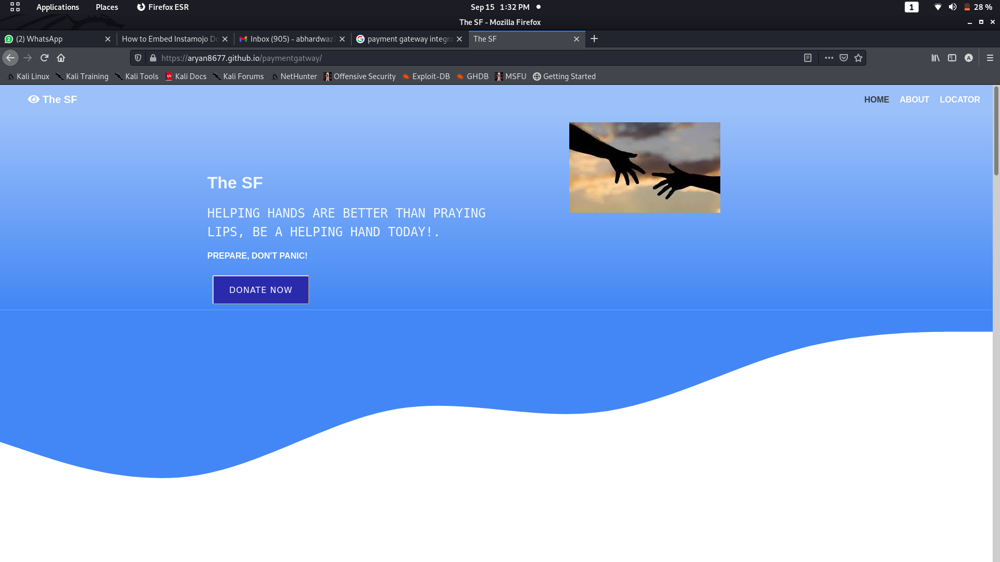
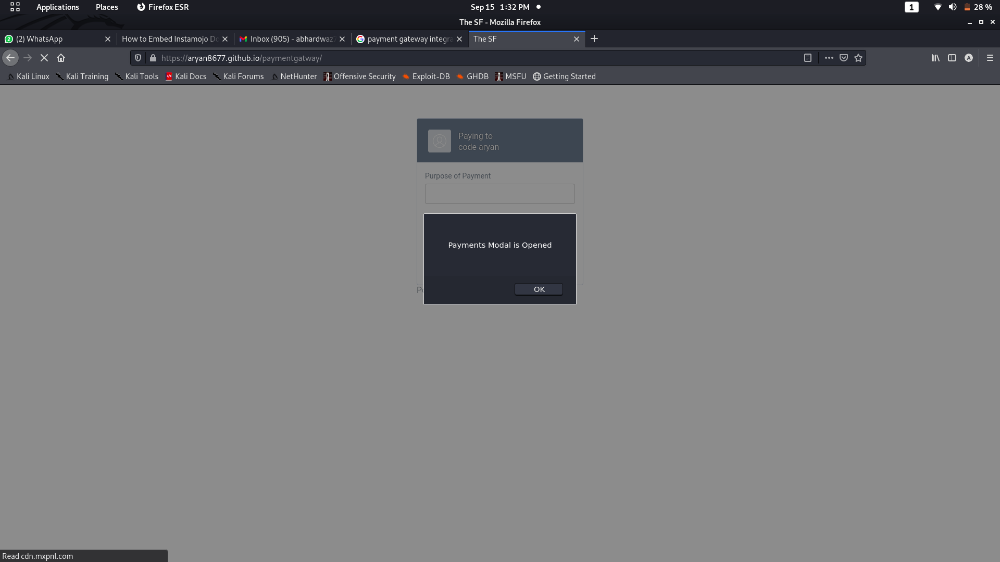
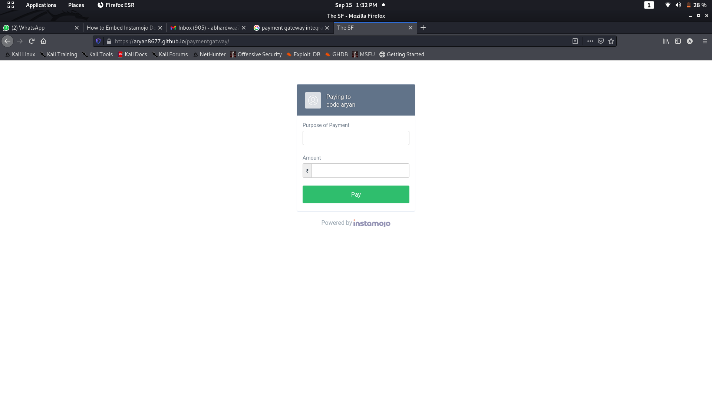
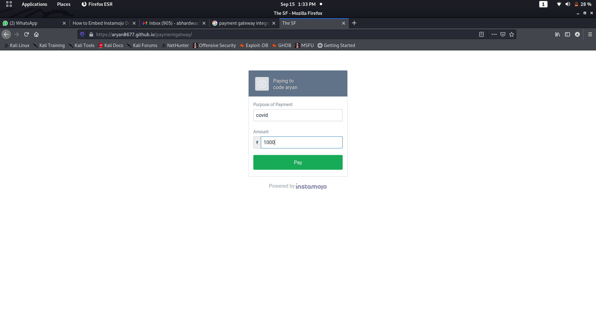
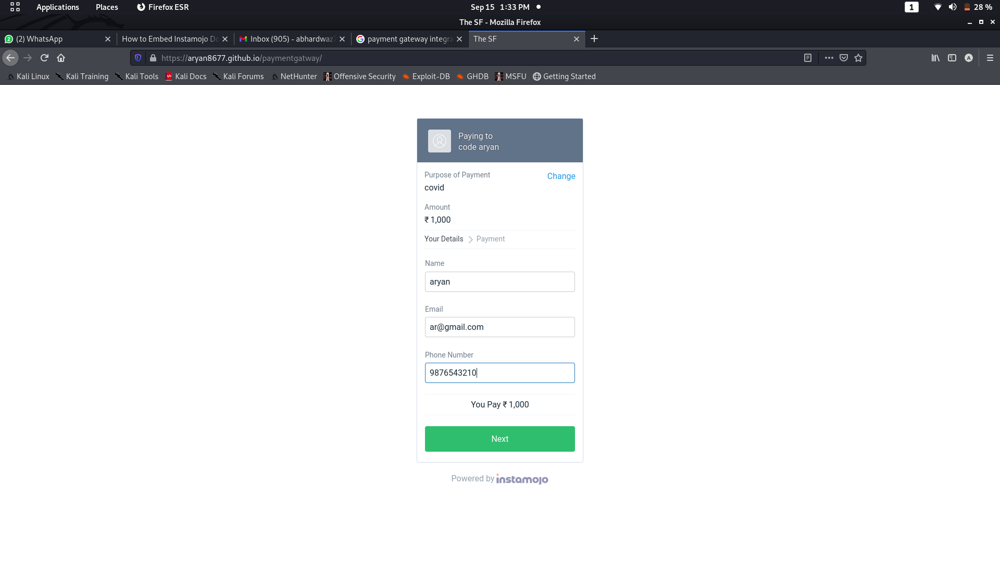
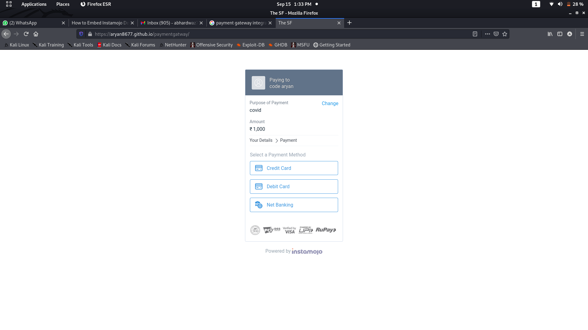
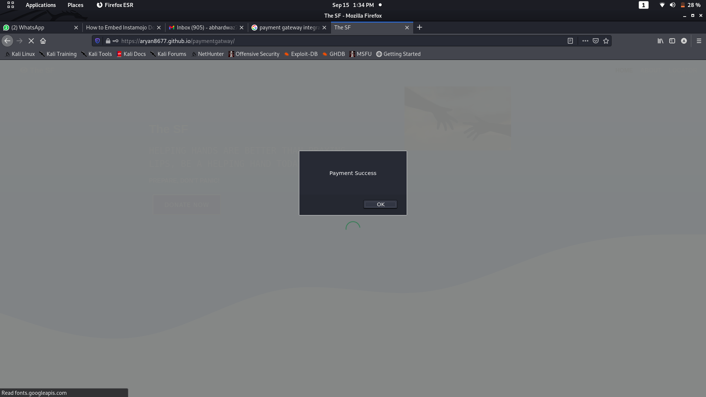
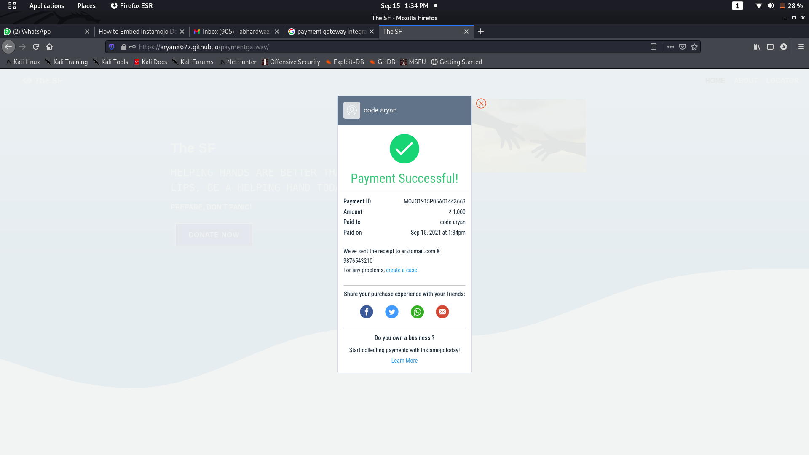
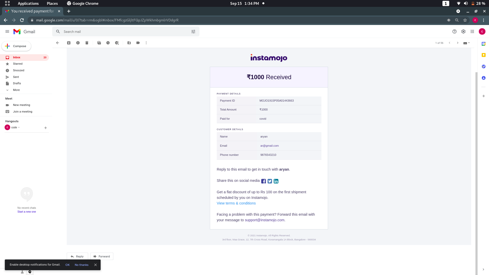

#Task:PAYMENT GATEWAY INTEGRATION
An internshhip project at The Sparks Foundation
<ul>
 <li>I have added payment gateway using Instamojo.</li>
  <li>It supports payments using credit card, debit card and net banking.</li>
 <li>The payment gateway also sends an email and a receipt to receipient's email.</li>
</ul>
<h2>Website Link</h2>
 <a href="https://aryan8677.github.io/paymentgatway/">paymentgatway</a>
 <a href="<a href="https://www.linkedin.com/posts/aryan-bhardwaz-09_task3-gripseptember21-gripsept21-activity-6843839454684229634-_Wfq">videolink</a>
  
<h2>Snapshots</h2>

